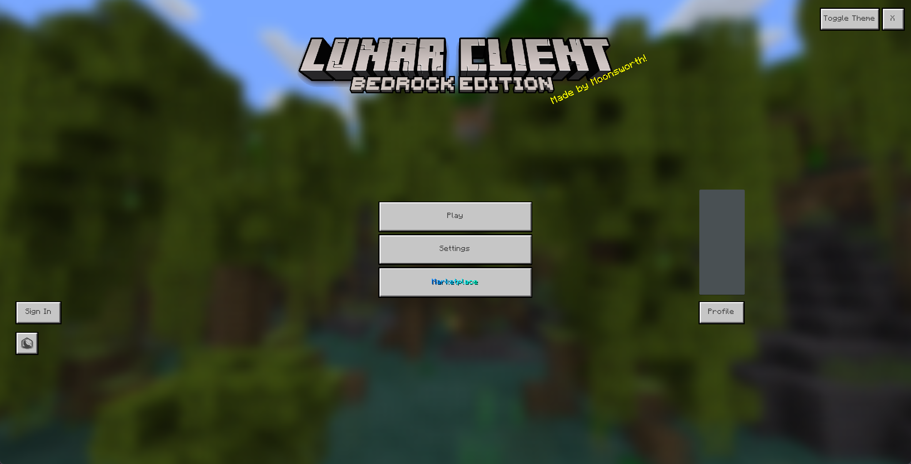

# LunarFools

Re-enables the Lunar Client April Fools menu.

## Building

Run `gradlew build` and a build artifact will be generated in `build/libs`

## Usage

You can use this agent with any program that loads Lunar Client agent, including [lunar-launcher-inject](https://github.com/Nilsen84/lunar-launcher-inject) to use this agent.
